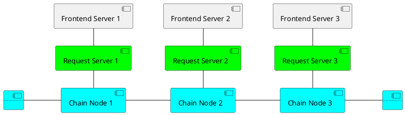

# System Architecture

| Component | Description |
| --- | --- |
| Chain Node | A node of the blockchain. This stores the records and handle the history and transaction requests from the Request Server (Change/View the score, information, etc) |
| Request Server | The off-chain backend of a Chain Node. This stores the pending requests from the user and is the only way to call a request to the Chain Node. Each Request Server may have different ways to handle user requests (Voting, Direct Request, etc) |
| Frontend Server | Provide the UX/UI for interacting with the Request Server |